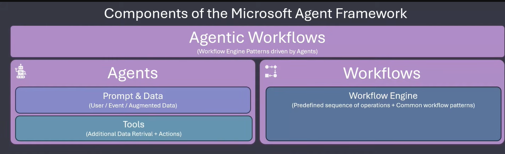

# 01. Agent Framework Fundamentals

##  Theoretical Foundations & Architecture

###  Overview

- **Microsoft Agent Framework (AF):** The modern successor to **Semantic Kernel** and **AutoGen**—Microsoft's foundational frameworks for building multi-agent systems and agentic workflows in .NET.
- Built on top of `Microsoft.Extensions.AI` (specifically leveraging abstractions like `IChatClient`), allowing seamless provider switching (OpenAI, DeepSeek, Azure OpenAI, etc.) without changing core application logic.

---

##  Components of Microsoft Agent Framework

### 1. Agents (Autonomous Brains)

Software components capable of processing LLM interactions:

- **Prompt & Data:** Consumes direct user input, background system events, or augmented contexts (RAG/Data Sources).
- **Tools:** Equips agents with functional capabilities to retrieve external data (e.g., database queries) or execute side-effect actions (e.g., triggering APIs, sending emails).

### 2. Workflows (Deterministic Engines)

- A structured execution engine that manages predefined operational sequences and branching logic.
- Pure C# flow control operating independently of AI reasoning to guarantee system predictability and order.

### 3. Agentic Workflows (Hybrid Intelligence)

- The synthesis of **Agents** and **Workflows**.
- Predefined logic (Workflow Engine) controls the overall application structure, while intelligent decision-making at specific execution nodes is delegated dynamically to AI Agents.

---

##  Key Takeaways

- **Decoupling:** Workflows handle _Structure_, Agents handle _Reasoning_, and `Microsoft.Extensions.AI` handles _LLM Communication_.
- **Flexibility:** You can use Agents standalone (e.g., in simple Console Apps or Web APIs) or embed them within complex Workflows when business processes require strict orchestration.
